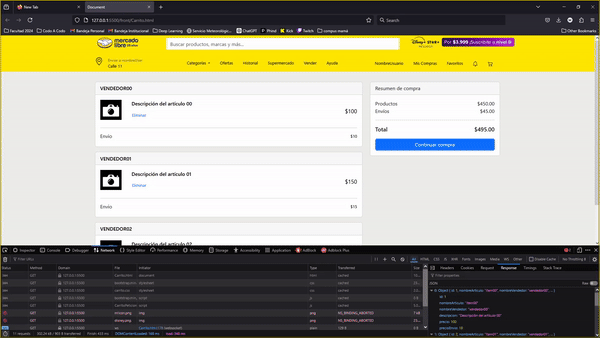

# PROYECTO-FINAL-BACKEND-CAC-2024
### Proyecto de Imitación de Carrito de MercadoLibre

Este proyecto es una imitación de la página del carrito de MercadoLibre. El objetivo del proyecto es demostrar el funcionamiento de una aplicación web completa, desde la conexión a la base de datos hasta la comunicación entre el front-end y el back-end, utilizando diversas tecnologías y herramientas.

## Descripción del Proyecto

El proyecto incluye las siguientes características y tecnologías:

- **Conexión a una base de datos:** La aplicación se conecta a una base de datos para almacenar y recuperar información sobre los productos y el carrito de compras.
- **Peticiones Front-End a Back-End:** Se implementan peticiones desde el front-end hacia el back-end para obtener y manipular datos del carrito de compras.
- **API con Tomcat:** Se levanta una API mediante el servidor de aplicaciones Tomcat para manejar las solicitudes y respuestas.
- **Uso de Servlets:** Los servlets se utilizan para gestionar las solicitudes HTTP y realizar operaciones en el servidor.
- **Controladores:** Se implementan controladores para manejar la lógica de negocio y las interacciones entre el modelo y la vista.
- **Maven:** El proyecto utiliza Maven para la gestión de dependencias y la construcción del proyecto.
- **Postman:** Postman se utiliza para probar las API y asegurarse de que las peticiones y respuestas funcionen correctamente.

## DELETE mediante el botón eliminar

